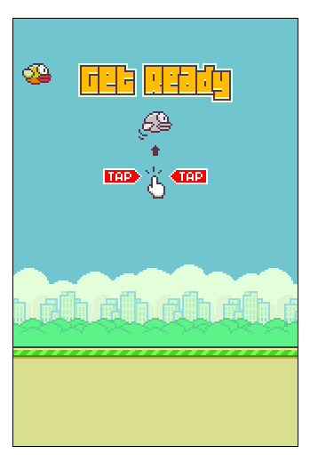
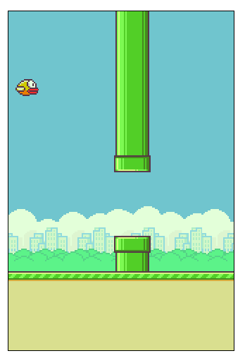

<h1 align="center">
  
</h1>

## 💻 Projeto

Projeto desenvolvido com base nos [Videos][playlist] do [Dev Soutinho][devsoutinho].
A ideia do projeto é reproduzir minimamente as funcionalidades e interface do jogo Flappy Bird. Tendo como único propósito, o aprendizado de novas tecnologias para desenvolvimento de software.

## 📷 Screenshots

<kbd>
  
</kbd>

---

<kbd>
  
</kbd>

[playlist]: https://www.youtube.com/watch?v=jOAU81jdi-c&list=PLTcmLKdIkOWmeNferJ292VYKBXydGeDej
[devsoutinho]: https://www.youtube.com/channel/UCzR2u5RWXWjUh7CwLSvbitA
